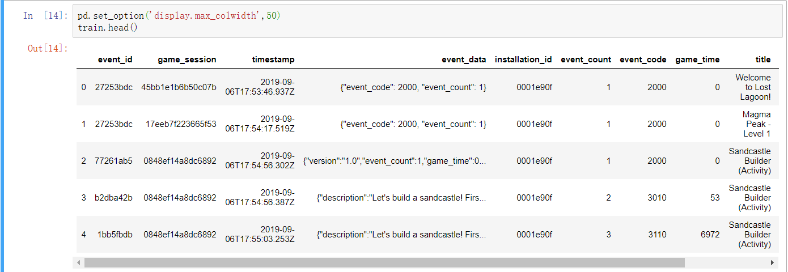
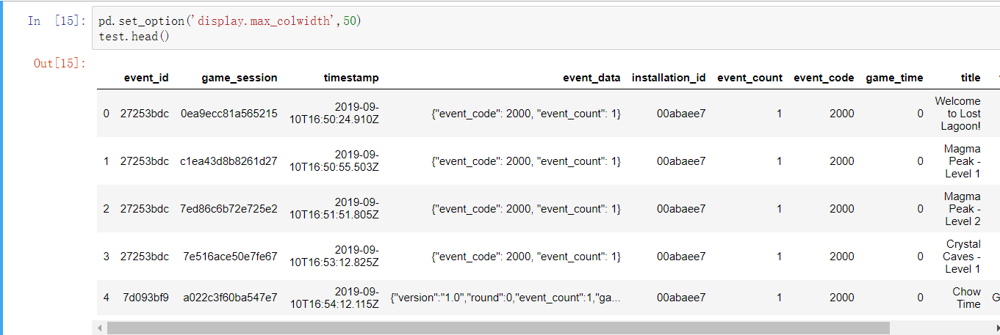
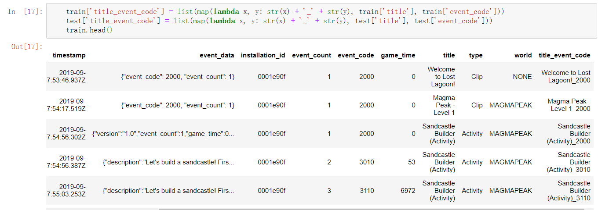
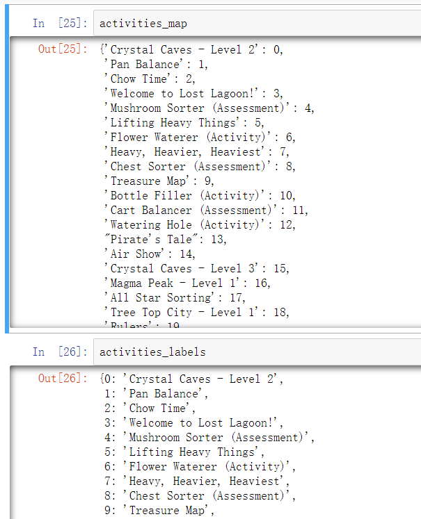
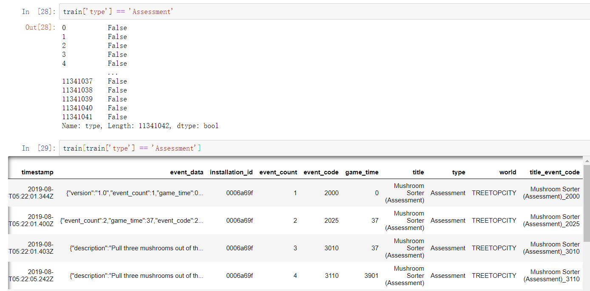
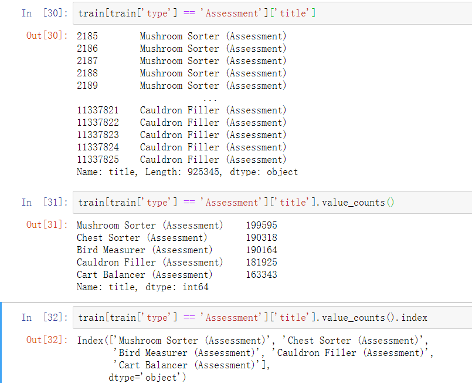
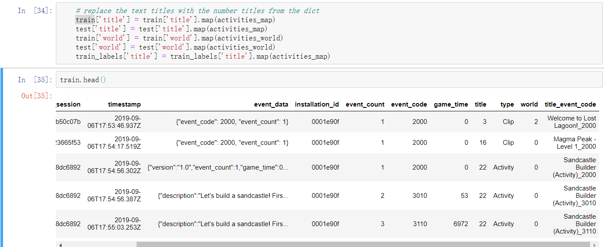
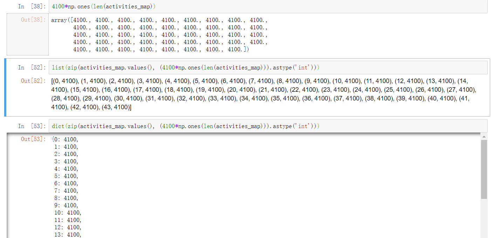

## 复现kaggle比赛2019DataScienceBowl现阶段排名第一的公共内核

复现过程中会添加我自己的注释和理解以及去除了一些根本没有使用过的变量

版本号为Version 24

原链接https://www.kaggle.com/braquino/convert-to-regression

首先是import一堆lib  没什么好说的

```python
# This Python 3 environment comes with many helpful analytics libraries installed
# It is defined by the kaggle/python docker image: https://github.com/kaggle/docker-python
# For example, here's several helpful packages to load in 

import numpy as np # linear algebra
import pandas as pd # data processing, CSV file I/O (e.g. pd.read_csv)
import matplotlib.pyplot as plt
import xgboost as xgb
from xgboost import XGBClassifier, XGBRegressor
from xgboost import plot_importance
from catboost import CatBoostRegressor
from matplotlib import pyplot

import shap
#A game theoretic approach to explain the output of any machine learning model.

import os

# Any results you write to the current directory are saved as output.
from time import time
from tqdm import tqdm_notebook as tqdm
from collections import Counter
from scipy import stats
import lightgbm as lgb
from sklearn.metrics import cohen_kappa_score, mean_squared_error
from sklearn.model_selection import KFold, StratifiedKFold
import gc
import json
pd.set_option('display.max_columns', 1000)
pd.set_option('display.max_colwidth',500)
```

```python
os.listdir(os.getcwd())
#看一下文件
```

```python
def eval_qwk_lgb_regr(y_true, y_pred):
    """
    Fast cappa eval function for lgb.
    计算QWK分数
    
    """
    dist = Counter(reduce_train['accuracy_group'])
    for k in dist:
        dist[k] /= len(reduce_train)
    reduce_train['accuracy_group'].hist()
    
    acum = 0
    bound = {}
    for i in range(3):
        acum += dist[i]
        bound[i] = np.percentile(y_pred, acum * 100)

    def classify(x):
        if x <= bound[0]:
            return 0
        elif x <= bound[1]:
            return 1
        elif x <= bound[2]:
            return 2
        else:
            return 3

    y_pred = np.array(list(map(classify, y_pred))).reshape(y_true.shape)

    return 'cappa', cohen_kappa_score(y_true, y_pred, weights='quadratic'), True

```

```
# read data
train, test, train_labels, specs, sample_submission = read_data()

Reading train.csv file....
Training.csv file have 11341042 rows and 11 columns
Reading test.csv file....
Test.csv file have 1156414 rows and 11 columns
Reading train_labels.csv file....
Train_labels.csv file have 17690 rows and 7 columns
Reading specs.csv file....
Specs.csv file have 386 rows and 3 columns
Reading sample_submission.csv file....
Sample_submission.csv file have 1000 rows and 2 columns
```

看一下数据是什么样的





下面是进行了一些简单的encode 我会解释每个特征变量的含义

```python
def encode_title(train, test, train_labels):
    # encode title
    train['title_event_code'] = list(map(lambda x, y: str(x) + '_' + str(y), train['title'], train['event_code']))
    test['title_event_code'] = list(map(lambda x, y: str(x) + '_' + str(y), test['title'], test['event_code']))
```
用title和event code生成了1列新的特征  没搞懂这个特征有什么意义  



```python
    all_title_event_code = list(set(train["title_event_code"].unique()).union(test["title_event_code"].unique()))
```
使用set 对这一列特征进行去重 创建了一个list


对title；event code；event id；world分别用set创建去重列表 为了之后变成一个新的特征


```python
    # make a list with all the unique 'titles' from the train and test set
    list_of_user_activities = list(set(train['title'].unique()).union(set(test['title'].unique())))
    # make a list with all the unique 'event_code' from the train and test set
    list_of_event_code = list(set(train['event_code'].unique()).union(set(test['event_code'].unique())))
    list_of_event_id = list(set(train['event_id'].unique()).union(set(test['event_id'].unique())))
    # make a list with all the unique worlds from the train and test set
    list_of_worlds = list(set(train['world'].unique()).union(set(test['world'].unique())))
```
继续往下看  写了3个dict  为什么要自己写 直接用sklearn不香吗  




```python
    # create a dictionary numerating the titles
    #实际上就是set(title)的label encoder
    activities_map = dict(zip(list_of_user_activities, np.arange(len(list_of_user_activities))))
    #把上一行的label encoder的2列反过来
    activities_labels = dict(zip(np.arange(len(list_of_user_activities)), list_of_user_activities))
    #set(world)的label encoder
    activities_world = dict(zip(list_of_worlds, np.arange(len(list_of_worlds))))
```
然后提取出所有类型为assessment的title






```python
    assess_titles = list(set(train[train['type'] == 'Assessment']['title'].value_counts().index).union(set(test[test['type'] == 'Assessment']['title'].value_counts().index)))
    #['Cart Balancer (Assessment)', 'Bird Measurer (Assessment)', 'Cauldron Filler (Assessment)', 'Mushroom Sorter (Assessment)', 'Chest Sorter (Assessment)']
```
使用刚才的dict 对dataset进行编码  实际上就是label encode



```python
    # replace the text titles with the number titles from the dict
    train['title'] = train['title'].map(activities_map)
    test['title'] = test['title'].map(activities_map)
    train['world'] = train['world'].map(activities_world)
    test['world'] = test['world'].map(activities_world)
    train_labels['title'] = train_labels['title'].map(activities_map)
```
创建一个dict  key是title的label   value是4100



```python
    win_code = dict(zip(activities_map.values(), (4100*np.ones(len(activities_map))).astype('int')))
    # then, it set one element, the 'Bird Measurer (Assessment)' as 4110, 10 more than the rest
    win_code[activities_map['Bird Measurer (Assessment)']] = 4110
```
最后是更新timestamp  更新一下格式
```python
    # convert text into datetime
    train['timestamp'] = pd.to_datetime(train['timestamp'])
    test['timestamp'] = pd.to_datetime(test['timestamp'])
    
    
    return train, test, train_labels, win_code, list_of_user_activities, list_of_event_code, activities_labels, assess_titles, list_of_event_id, all_title_event_code
```

这里总结一下这个方法都干了什么

创建了一个新特征'title_event_code'

对特征title 和  world 进行了encode

创建了几个list和dict 分别为

```
list(后面会用到的):
all_title_event_code-->set["title_event_code"]
list_of_event_code-->set['event_code']
list_of_event_id-->set['event_id']
assess_titles-->set(train[train['type'] == 'Assessment']['title'].value_counts().index  类型为assessment的所有title
```

```
dict:
activities_labels-->dict{key是数字  value是不重复的title}
win_code-->dict{key是title的label  value是4100或4110}
```

可以看到这个方法没有做什么归一化之类的  就是简单的预处理一下

待续...

